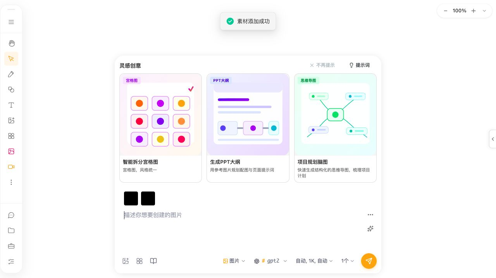
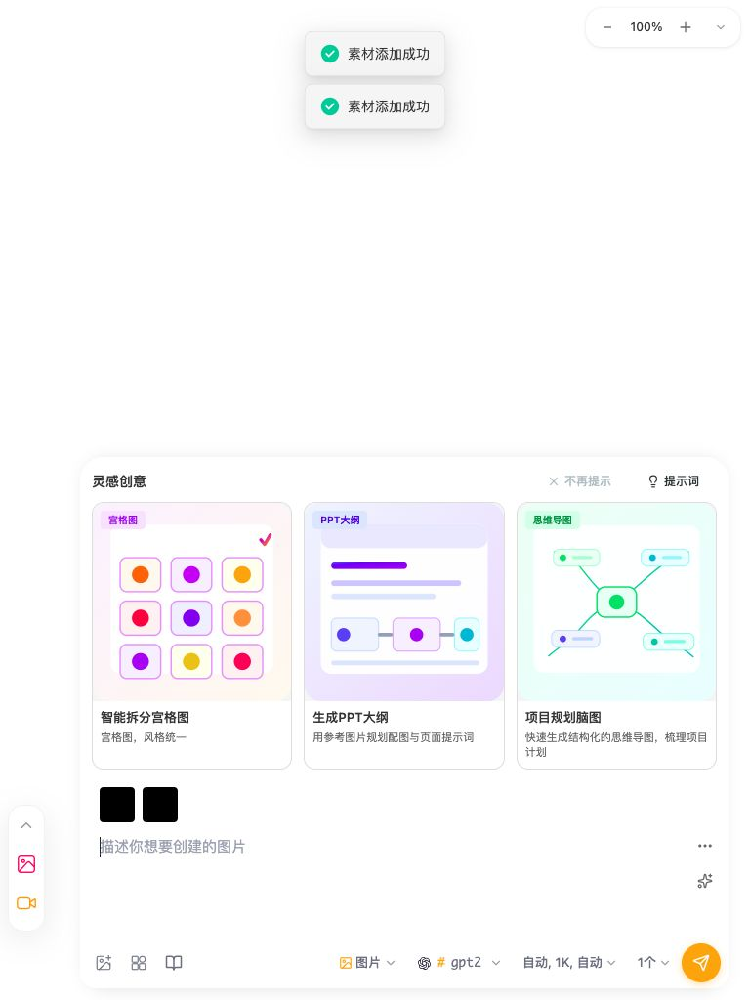
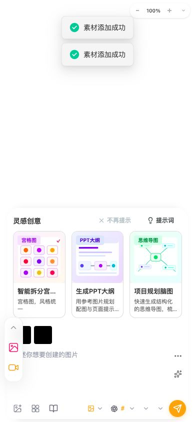

# F-07 AI-input clipboard and attachment browser evidence

Date: 2026-07-30 (Asia/Shanghai)

## Scope, environment, and safety

This subcycle verifies only the existing `add-ai-input-paste-images` browser behavior: paste inside the primary AI input, ignore paste outside it, add the same image twice, remove both attachments, current desktop/tablet/mobile geometry, and current accessible names. It does not submit a generation, call a provider, read credentials, inspect browser storage, or claim generation participation.

- Source artifact: current `dist/apps/web`, served from `http://127.0.0.1:7397/?sw=0`; the local server was stopped afterward and port 7397 had no listener.
- Browser: Codex in-app Chromium; exact build and device pixel ratio were not exposed. One loopback-origin tab was reused while the viewport override changed to 1280×720, 768×1024, and 390×844 CSS px. The encoded screenshots have the same pixel dimensions as those viewport requests.
- Locale/theme: `zh-CN`, light appearance in screenshots. No CPU/network throttle was configured. This is one functional/layout sample per viewport, not a performance benchmark.
- Fixture: one synthetic 68-byte, 1×1 `image/png` written to the isolated browser clipboard; a real `Meta+V` key action was used. The same fixture was pasted twice per viewport. Attachment state was returned from 2→1→0 between viewports. The accepted images also traversed the existing local-asset writer, as shown by the existing “素材添加成功” UI; those test-origin asset records were not inspected or deleted.
- The browser control surface did not expose request interception. No submit, provider, discovery, health, price, benchmark, external-tool, import/export, or credential action was invoked. The local HTTP log contains only application assets requested from the loopback server; it is not represented as a complete browser-network capture.
- Browser error log after the matrix: 0 entries. Browser storage, cookies, IndexedDB/localForage contents, API keys, tokens, `.npmrc`, and real user clipboard contents were not read.
- Repository limitation: the directory has no Git metadata, so worktree cleanliness/history cannot be checked. OpenSpec CLI remains unavailable; strict validation is blocked rather than reported as passing. Formal Playwright projects still require missing `chromium_headless_shell-1200`; this in-app run is browser evidence, not a claim that those projects passed.

## Method and complete chain

For each viewport, the browser first focused a unique visible toolbar button outside `[data-testid="ai-input-bar"]`, pressed `Meta+V`, and counted preview items only inside the primary input owner. It then focused `[data-testid="ai-input-textarea"]`, pasted once, pasted the identical image again, captured control/name counts and geometry, saved a screenshot, and clicked the scoped remove buttons until no primary-input preview remained.

The preview count must be scoped to the primary input. `AIInputBar.tsx:2654-2666` mirrors `allContent` into Chat Drawer context; the closed Drawer composer therefore renders a second offscreen preview at x=1312 in the desktop sample. The first unscoped diagnostic count changed 0→2 after one paste, but bounded DOM ownership proved one primary-input item and one offscreen Drawer projection, not two state writes. All recorded assertions use the unique primary-input owner.

Forward chain:

`Meta+V` → document paste listener (`AIInputBar.tsx:2668-2710`) → active-element containment gate → image `DataTransferItem` to `File[]` → `importLocalImages():2471-2571` → type/size/compression validation → `AssetContext.addAsset():1022-1076` → `assetStorageService.addAsset` and success feedback → Base64/dimension conversion → `setUploadedContent` → `allContent:1377-1380` → `AIInputComposerShell`/`SelectedContentPreview:5053-5062` → visible preview and shared Chat Drawer projection.

Remove chain:

Visible shared remove button (`SelectedContentPreview.tsx:222-238`) → `onRemove(index)` → `AIInputBar.handleRemoveUploadedContent():2642-2652` → uploaded state filter → `allContent` recompute → primary preview and Drawer projection update.

Static generation continuation, not browser-submitted:

`allContent` → `handleGenerate` effective content (`AIInputBar.tsx:3066-3099`) → images/graphics and aligned dimensions (`:3171-3199`) → `referenceImages` (`:3220`) → workflow conversion (`:3222-3324`) → retry/UI handoff (`:3650-3664`) → existing main-thread workflow/task chain. Because the credential preflight at `:3142-3169` precedes this conversion, a no-credential click cannot safely prove the resulting workflow context; no provider task was submitted.

Reverse chain:

Primary preview/remove DOM → unique `data-testid="ai-input-bar"` owner → `SelectedContentPreview` props → `allContent` → uploaded state → sole paste import writer. Asset success feedback → `AssetContext.addAsset` → `assetStorageService.addAsset` ← same `importLocalImages` caller. Downstream `referenceImages` has the one `effectiveContent` classifier above, but generation-time participation remains blocked until a deterministic provider-free submission harness observes the produced context.

## Browser results

| Viewport | Primary previews before | After outside paste | After first inside paste | After duplicate paste | After first remove | After second remove | Horizontal overflow | Browser errors |
| --- | ---: | ---: | ---: | ---: | ---: | ---: | --- | ---: |
| 1280×720 | 0 | 0 | 1 | 2 | 1 | 0 | none (`1280=1280`) | 0 |
| 768×1024 | 0 | 0 | 1 | 2 | 1 | 0 | none (`768=768`) | 0 |
| 390×844 | 0 | 0 | 1 | 2 | 1 | 0 | none (`390=390`) | 0 |

The observed normal/duplicate/remove/outside-focus behavior satisfies `add-ai-input-paste-images` task 3.2 and the removal/repeat portions of 3.1. Task 3.1 remains unchecked because generation participation was not browser-observed. The source and existing converter tests prove the current downstream writer chain, but do not replace that integration condition.

## Geometry and screenshots

| Viewport | Primary bar `(x,y,w,h)` | Textarea `(x,y,w,h)` | First preview | Remove target |
| --- | --- | --- | --- | --- |
| 1280×720 | `(280,143.78,720,564.22)` | `(308,540,628,102)` | `(320,496,36,36)` | `(338,498,16,16)` |
| 768×1024 | `(70,467.78,688,544.22)` | `(90,850,612,102)` | `(102,806,36,36)` | `(120,808,16,16)` |
| 390×844 | `(8,416.44,374,421.56)` | `(18,696,318,86)` | `(26,652,36,36)` | `(44,654,16,16)` |

The three files use `.png` names but the browser emitted JFIF JPEG bytes; `file` reported the requested 1280×720, 768×1024, and 390×844 dimensions. Hashes and byte sizes are in `metrics.json`.

The 390×844 screenshot also confirms the already-owned `F28-LAYOUT-002` root cause in an attachment-preview state: the higher collapsed toolbar visibly covers the left side of the first 36×36 attachment preview and its control region. The exact primary preview rectangle is recorded above; this run did not separately capture the toolbar rectangle, so it does not invent a new intersection area. `fix-mobile-toolbar-input-overlap` already specifies attachment-preview coverage and remains approval-blocked.

## [AI-INPUT-A11Y-001] Browser confirmation for upload, library, and send names

**Status**: confirmed current browser behavior; existing OpenSpec change updated, implementation blocked on approval.

**User impact and reproduction**: with the primary AI input visible, enumerate buttons by role/name in Chinese. At every viewport there was one upload, one library, and one send control by stable DOM identity, but zero named “上传图片”, “从素材库选择”, or “发送”. The accessibility snapshot rendered each as an unnamed `button`.

**Current versus expected**: the existing actions are pointer-operable and HoverTip-labelled, but their buttons expose no accessible names. Expected under the proposal is a localized name and unchanged pointer/keyboard callback, with upload/library explicitly non-submit.

**Evidence and call chain**: browser counts in `metrics.json`; `AIInputBar.tsx:4842-4875,5032-5051` renders icon-only buttons; assistive technology → button accessible-name computation → missing own text/ARIA → unnamed control → existing callbacks. The equivalent Drawer controls already provide names. Evidence strength is strong current browser tree plus unique source writers.

**Solution, alternatives, risks, validation, rollback**: `improve-ai-input-control-accessibility` owns the minimal attributes and localized tests. HoverTip-only is rejected because it is not the button name. Risks are locale drift and accidental form submission; post-approval tests cover zh/en role/name and existing callbacks. Roll back attributes/tests only; no data changes.

## [AI-INPUT-A11Y-002] Shared attachment removal is unnamed, hover-only, and 16×16

**Status**: confirmed browser/source accessibility and touch defect; added to the existing F-07 accessibility proposal, implementation blocked on approval.

**User impact and reproduction**: paste two images at 1280×720, 768×1024, or 390×844. The primary input contains two `.selected-content-preview__remove-btn` buttons and zero buttons named “移除”. Each target is exactly 16×16 CSS px. In the captured non-hover state no removal affordance is visible; source sets opacity to zero and only an item `:hover` rule reveals it. A screen-reader user cannot identify the operation from the button, a keyboard user has no focus-visible reveal rule, and a non-hover touch user has no persistent visual affordance.

**Current versus expected**: current pointer hover can reveal and activate the correct callback; the browser automation confirmed 2→1→0 removal. Expected is the same removal state transition with a localized, distinguishable name, visible keyboard/coarse-pointer affordance, explicit non-submit behavior, and at least 24×24 CSS px hit target that does not cover adjacent attachments.

**Complete call chain and root cause**: `AIInputBar.tsx:5053-5062` and `EnhancedChatInput.tsx:411-424` → shared `SelectedContentPreview` → `canRemove` (`SelectedContentPreview.tsx:163-167`) → HoverTip plus icon-only button (`:222-238`) → caller `onRemove(index)` → uploaded-content filter → UI projection. Reverse from every remove button reaches this one shared writer. `selected-content-preview.scss:187-223` fixes 16×16, default opacity 0, and has only hover visibility. Root cause is treating a hover hint as both the semantic label and the only discoverability state.

**Impact and evidence strength**: main AI input and Chat Drawer uploaded attachments; selected canvas/implicit references without `onRemove` are unaffected. Strong exact browser name/geometry counts, screenshots, CSS state proof, and shared caller trace. Actual physical-device hover emulation remains unmeasured, but the default invisible/unnamed/16×16 states do not depend on that unknown.

**Candidate, alternative, risk, validation, rollback**: the updated change provides bounded metadata-derived names, focus/non-hover visibility, and a preview-local ≥24×24 target. A label-only fix leaves the visual/target defect; globally enlarging previews is unnecessary. Risk is covering an adjacent thumbnail or adding fine-pointer noise. Verify role/name, focus visibility, Enter/Space, coarse pointer, adjacent hit testing, zh/en, light/dark, and all three viewports after approval. Roll back only shared attributes/CSS/tests; attachment data remains compatible.

## Residual blockers and cleanup

- `add-ai-input-paste-images` is now 8/9. Outside paste, duplicate addition, local asset feedback, preview, and removal have current browser evidence. Generation participation remains blocked on a deterministic provider-free submission harness; no task was submitted.
- `improve-ai-input-control-accessibility` remains approval-only. No runtime JSX or CSS changed in this subcycle.
- Dark theme, English runtime, reduced motion, browser zoom/high-DPI, physical touch, image validation failure, compression threshold, oversized rejection, slow storage, quota failure, offline refresh, and real generation remain unverified here.
- Formal smoke/feature/visual/responsive Playwright stays environment-blocked by the configured revision-1200 absence. The in-app browser viewport evidence removes the earlier blanket desktop/tablet/mobile claim only for the recorded F-07 states.
- The temporary browser probe was deleted, the viewport override was reset, browser tabs were finalized, the loopback server was stopped, and port 7397 had no listener.
