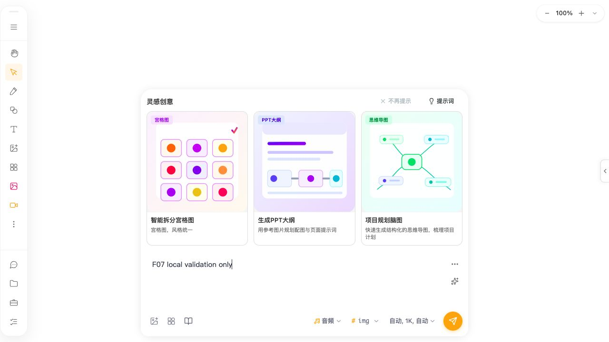

# F-07 AI-input preference persistence and empty-model evidence

Date: 2026-07-30 (Asia/Shanghai)

## Scope, environment, and safety

This subcycle verifies the existing AI-input generation preference behavior without submitting a task. It covers visible image parameter changes, generation-type round trips, same-origin reload, tab close/reopen, and the empty video/audio model state. It does not inspect browser storage, create provider profiles, read credentials, call model discovery, or click the send button.

- Source artifact: current `dist/apps/web`, served from `http://127.0.0.1:7400/?sw=0`.
- Browser: Codex in-app Chromium, exact build not exposed; 1280×720 CSS px, `zh-CN`, light appearance, no configured CPU or network throttle.
- Origin state: port 7400 was a fresh loopback origin for this run. All preference values were changed and observed through visible controls only.
- Samples: one functional sample for each state transition. These are not timing or performance samples.
- Safety: no provider request or paid task was submitted. Browser storage, cookies, IndexedDB/localForage contents, API keys, tokens, `.npmrc`, and real clipboard contents were not read.
- Repository limitations: Git metadata is absent, OpenSpec CLI is unavailable, and formal Playwright remains blocked by the missing configured `chromium_headless_shell-1200` revision. This in-app run does not claim those tools passed.

## Preference recovery method and results

The fresh origin opened in image mode with `gpt-image-2`, parameter summary `自动, 1K, 自动`, and count `1个`. Through the visible parameter controls the state was changed to `16:9 横版, 2K, 标准`, then the visible count control was changed to `2个`.

| Transition | Generation type | Model | Parameter summary | Count | Result |
| --- | --- | --- | --- | --- | --- |
| Fresh origin | 图片 | `gpt-image-2` | `自动, 1K, 自动` | `1个` | Baseline |
| Visible edits | 图片 | `gpt-image-2` | `16:9 横版, 2K, 标准` | `2个` | Values accepted |
| 图片 → 文本 → 图片 | 图片 | `gpt-image-2` | `16:9 横版, 2K, 标准` | `1个` | Model parameters restored; count was normalized by text mode |
| Count reset to 2, then reload | 图片 | `gpt-image-2` | `16:9 横版, 2K, 标准` | `2个` | All four visible fields restored |
| Close tab, open new tab to same URL | 图片 | `gpt-image-2` | `16:9 横版, 2K, 标准` | `2个` | All four visible fields restored |

This satisfies `add-ai-generation-state-persistence` task 3.1 for the bottom AI input: both a same-origin reload and a full tab close/reopen reconstructed the visible generation type, model, parameters, and count. The cross-type count change is not classified as a defect: `AIInputBar.tsx:1445-1451` explicitly normalizes text, agent, and audio modes to one result, and the model-scoped preference spec does not promise a count per model or per generation type.

Forward recovery chain:

visible parameter/count controls → `handleParamSelect` / `handleCountSelect` → `selectedParams` / `selectedCount` → `saveAIInputPreferences` and `saveScopedAIInputModelParams` (`AIInputBar.tsx:2999-3022`) → localStorage writer (`ai-generation-preferences-service.ts:532-602,766-806`) → component reinitialization (`AIInputBar.tsx:1052-1107,1133-1162,1301-1331`) → compatibility alignment (`:2927-2997`) → `ParametersDropdown` / `CountDropdown` visible summaries (`:5005-5028`).

Reverse recovery chain:

restored visible summaries → `selectedModel`, `selectedParams`, and `selectedCount` owners → initialization helpers → unique AI-input preference storage key and scoped model record. No prompt, attachment, or knowledge context was restored or inspected.

## [AI-INPUT-MODEL-001] Empty target type retains a stale model and permits submission

**Status**: confirmed current browser behavior plus complete source trace. Runtime repair is blocked on approval of the updated `add-model-scoped-generation-preferences` change.

**User scenario and reproduction**:

1. Start in image mode with a valid selected image model.
2. Switch to video or audio when that target type has no selectable models in the current catalog.
3. Observe that the model control says `选择模型 (↑↓ Tab)` while an image-parameter summary remains visible.
4. Enter the synthetic text `F07 local validation only` without clicking send.
5. The send button has no `disabled` attribute and class `ai-input-bar__send-btn active`.

The earlier stable video state showed `选择模型 (↑↓ Tab)` together with `16:9, 1K, 自动`. The captured audio state showed `选择模型 (↑↓ Tab)` together with `自动, 1K, 自动`; after text input, the send button became active. No generation request was made.

**Current versus expected**: current UI simultaneously represents “no selected audio model”, image-compatible parameters, and an enabled send action. The submitted path would reuse the retained model state with `generationType: audio`. Expected under the updated proposal is to clear the prior modality's model and parameter projection, and keep submission unavailable until a compatible target-type model exists.

**Complete call chain and root cause**:

`GenerationTypeDropdown.onSelect` (`AIInputBar.tsx:4889-4894`) → `setGenerationType` → target `currentModels` is empty (`:1529-1542`) → type reconciliation finds no next model (`:1404-1422`) → because built-in fallback mode is not provider-selection mode, the conditional clear at `:1433-1439` does not run. Independently, `ModelDropdown` detects its empty list and calls `onSelect('', null)` (`ModelDropdown.tsx:358-399`), but the bound `handleModelSelect` resolves an empty ID, finds no config, and returns without clearing (`AIInputBar.tsx:2768-2782`). The prior `selectedModel` therefore remains the state owner.

That retained ID feeds `getCompatibleParams` / `getEffectiveVideoCompatibleParams` (`AIInputBar.tsx:1605-1636`), so the old media parameter controls render (`:5005-5017`). `canGenerate` checks only prompt or attachment presence (`:4752`), so the send button becomes active (`:5032-5051`). If clicked, `handleGenerate` would copy the retained model into analytics, credential resolution, and `parseAIInput` while using the new generation type (`:3076-3085,3104-3156,3201-3217`). The browser did not click it.

Reverse trace from the active send button reaches the single `canGenerate` expression; reverse trace from the stale parameter summary reaches `compatibleParams`, the retained `selectedModel`, and both failed clear paths above. This is stronger than an inference from labels: it combines stable browser DOM state, an enabled-button attribute/class check, and unique state writers/readers.

**Impact**: bottom AI input generation-type switches when the target modality has no selectable model. The recorded environment affected video and audio; image and text had valid selectable defaults. No evidence was gathered for independent generation dialogs, so they are not included in this issue.

**Candidate and alternative**: the bounded proposal requires one canonical nullable selection transition, clears stale parameters, and includes valid-model presence in submission availability. An alternative is to inject a built-in fallback model; that conflicts with authoritative provider-only empty-state rules and does not solve genuinely unsupported modalities. Another alternative is to hide parameters only; that leaves the stale model in the submission payload and is insufficient.

**Risk, validation, and rollback**: the main risk is clearing a valid model during a transient catalog-loading empty state. Implementation must distinguish loading from a resolved empty collection using existing runtime-model state, preserve valid selection and payload semantics, and add component coverage for empty, loading, and later-model-available transitions. Browser verification must repeat the exact no-model state, confirm hidden old parameters and disabled send, then confirm normal recovery after a valid model appears. Rollback is limited to selection reconciliation, submit availability, and their tests; no storage key, schema, migration, task record, cache, or user data deletion is proposed.

The file uses a `.png` name but contains a 1280×720 JPEG/JFIF image, matching the browser screenshot encoder used by the earlier F-07 evidence.

## Remaining verification boundaries

- Focused preference service verification used Node 24.14.0 and Vitest 3.2.4 from `packages/drawnix`: exit 0, 1/1 file and 11/11 tests passed in 2.64s. The first two root-directory invocations used filters outside Vitest's configured relative include boundary and each exited 1 with “No test files found”; these were command-scope failures, not product or test failures. Existing `indexedDB is not defined` ConfigWriter stderr did not fail the jsdom assertions and remains classified as test-environment noise.
- `add-ai-generation-state-persistence` is 6/7. Task 3.1 is complete. Task 3.2 remains open because the empty-model case currently fails the intended compatibility invariant and repair requires approval.
- `add-model-scoped-generation-preferences` is 12/16 after adding the confirmed empty-model repair and verification tasks. Only one image model, three text models with the same visible parameter contract, and no video/audio model were selectable in this safe fixture. This cannot satisfy the required two-model image/video/audio matrix.
- Service-level tests prove `selectionKey` isolation for two synthetic providers, but this run did not create provider profiles or inspect storage. Same-ID cross-provider UI verification remains blocked on a safe deterministic profile/catalog fixture.
- No performance improvement is claimed. There is one before screenshot and no after screenshot because runtime implementation is approval-blocked.
- Cleanup completed: the synthetic prompt was cleared, the test tab was closed with no remaining in-app Browser tabs, server session 80151 was interrupted cleanly, and `lsof -nP -iTCP:7400 -sTCP:LISTEN` exited 1 with no listener.
