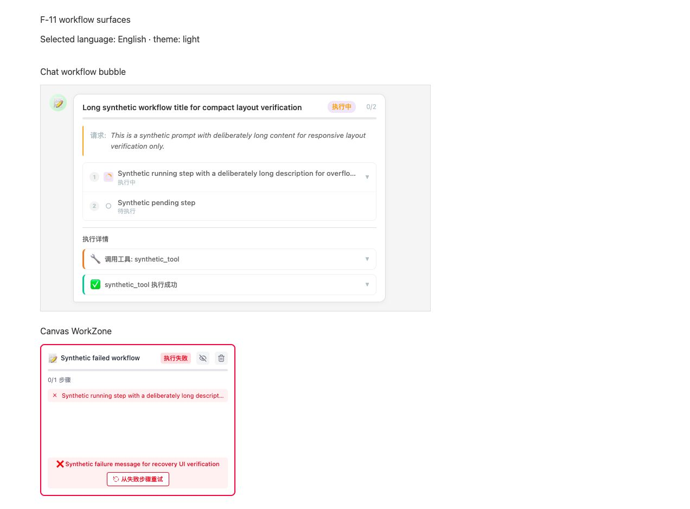
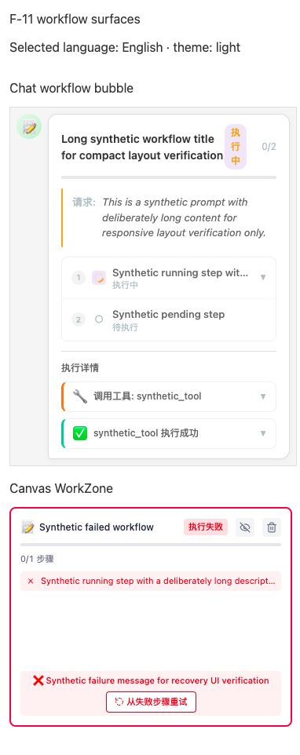

# F-11 workflow status interface accessibility evidence

Date: 2026-07-30 (Asia/Shanghai)

## Scope and evidence limits

- User scenario: a user submits an existing workflow, reads lifecycle/step/Agent details in Chat and on the canvas WorkZone, follows progress, handles failure/retry, changes the application language, and operates existing details/actions by pointer, keyboard, touch, or assistive technology.
- In scope: `WorkflowMessageBubble`, its step and Agent-log disclosures, visible progress/status, existing failure/retry/reply/result labels, `WorkZoneContent`, WorkZone hide/delete/retry/confirmation controls, independent-root language context, compact geometry, small-text contrast, and the registered render path.
- Out of scope: workflow parsing/execution/dynamic steps, task projection, cancellation, retry ownership/result, refresh recovery, Chat session/composer/drawer shell, task drawer, model/provider routing, storage schemas, cache, media insertion, new workflow actions, global palette redesign, and dark-mode addition.
- Source state: this workspace has no Git metadata. History, diff provenance, worktree cleanliness, and Git-based rollback cannot be checked.
- Privacy: the diagnostic used synthetic workflow names, steps, logs, failures, and results. It did not read user task/chat/board/localForage/IndexedDB/localStorage contents and did not call a provider, network API, telemetry, GitHub, log export, `.npmrc`, API key, or token.
- These are DOM, accessibility, geometry, localization-boundary, and computed-color facts. They are not performance measurements; no speed, memory, render-count, or bundle-size improvement is claimed.

## Environment and method

- Component diagnostic: workspace Node.js 24.14.0, Vitest 3.2.4, jsdom, real `WorkflowMessageBubble`/`WorkZoneContent`, real project providers and styles, synthetic inputs, no network.
- Browser geometry: Vite 6.4.1 on `127.0.0.1:7200`; Codex in-app Chromium (exact revision unavailable); 1280×720, 390×844, and 320×568 viewport samples; DPR 1; no CPU/network throttling; CSS zoom 100%; application forced-light variables.
- The temporary diagnostic test and browser harness were deleted after recording evidence. The viewport override was reset, browser tab finalized, Vite stopped, port 7200 verified closed, and no temporary diagnostic file remains.
- Raw structured observations are in `metrics.json`; screenshots are cropped synthetic evidence and contain no user data.

## Relevant specifications and active changes

- No formal current spec owns Chat/WorkZone keyboard, progress, localization, compact-target, or contrast behavior. The new approval-gated owner is `improve-workflow-status-interface-accessibility` (`workflow-status-interface-accessibility`, 5 requirements, 11 scenarios, 28 tasks; 7 evidence/manual-validation tasks complete).
- `fix-main-thread-workflow-recovery-sync` owns task-backed recovery, cross-workflow isolation, one task projection, and persisted terminal-state convergence. This interface change consumes already-derived state and does not alter that owner.
- `improve-task-queue-responsive-accessibility` owns task-drawer semantics/layout/localization/announcements. No task panel source or requirement is copied here.
- `update-ui-color-system` owns broad palette changes. The workflow proposal only permits current tokens or scoped contrast-safe forced-light values.
- `apps/web/src/styles.scss:100-109` explicitly sets `color-scheme: light` and forces light variables. Dark mode is not an existing supported state and is only a candidate new capability, not an F-11 defect.
- `apps/web/src/styles.scss:267-272` already reduces all animations to 0.01 ms and one iteration under `prefers-reduced-motion: reduce`. Missing component-local motion rules are therefore a non-finding.

## Current forward and reverse chains

### Chat surface

Forward:

`drawnix.tsx:870-938` main `I18nProvider` → `ChatDrawerProvider` → `ChatDrawer.tsx` workflow-message `Map`/ref → `ChatMessagesArea.tsx:93-117` marker lookup → `WorkflowMessageBubble.tsx:364-559` normalized state/progress → `:572-805` header, visual progress, step/Agent disclosures, summary/retry/result UI → DOM/accessibility tree.

Persistence/reverse:

visible workflow bubble/terminal result → `ChatMessagesArea` workflow message ID → `ChatDrawer` update/retry/reply handlers → `handleSendWorkflowMessage` / `handleUpdateWorkflowMessage` / `handleSyncWorkflowTaskUpdate` → chat storage/localForage `aitu-chat/messages` → reload restores message marker and `workflowMessages` → the same `WorkflowMessageBubble`. Task-to-Chat terminal projection remains owned by `fix-main-thread-workflow-recovery-sync`.

State ownership and side effects:

- Workflow lifecycle/counts are derived from normalized steps at `WorkflowMessageBubble.tsx:371-391`; each step and Agent log locally owns only its `expanded` boolean at `:96-97,220-221`.
- Step/Agent header click changes only local disclosure state. Retry/reply/media callbacks leave the component and are intentionally unchanged by this investigation.
- The current automatic scroll at `:542-559` is a visual side effect when the current step changes; it is not a progress announcement and is not altered before approval.

### WorkZone surface

Forward:

`AIInputBar` non-image workflow submission → `WorkZoneTransforms.insertWorkZone` → board `PlaitWorkZone` child → `drawnix.tsx:761` registered `withWorkZone` plugin → `with-workzone.ts:216-235` `WorkZoneComponent.renderContent()` → separate React `createRoot` → `ToolProviderWrapper` → `WorkZoneContent` → progress/actions/steps/failure UI.

Reverse:

WorkZone delete/hide/retry/state callback → `with-workzone.ts` handlers → board transform/local visibility setting/workflow retry → task/workflow events → WorkZone element update → `WorkZoneComponent.onContextChanged()` → rerendered `WorkZoneContent`. Board persistence/refresh reconstructs the element through the registered plugin. Recovery semantics remain outside this UI proposal.

State ownership and side effects:

- `WorkZoneContent.tsx:235-265` derives visible status/progress from current steps and owns only retry-in-flight/confirmation state; `withWorkZone` supplies the real delete, state-change, retry, and hide callbacks at `with-workzone.ts:225-232,251-258`.
- `ToolProviderWrapper.tsx:38-51` creates a new `I18nProvider` with its default `zh`. React context from the outer root cannot cross this `createRoot`; the WorkZone therefore has an independent language owner today.

## Controlled observations

### Real-component diagnostic

Normalized command:

`node node_modules/vitest/vitest.mjs run src/components/workzone-element/f11-workflow-ui.diagnostic.test.tsx --config vitest.config.ts --reporter=verbose`

The first attempt through `pnpm exec` failed with exit 127 because that shell did not expose Node; this is a tool-environment failure, not a product defect. Running the same test with the workspace-provided Node runtime succeeded: exit 0, 1/1 file, 2/2 tests.

Raw component results:

- Chat: zero focusable disclosure entries; step-details trigger was `div`, no role, `tabIndex=-1`; two Agent tool-call/result triggers were `div`, no role, `tabIndex=-1`; Enter did not expand, pointer click did.
- Chat: zero progressbars and zero live regions. Under an English provider, `执行中` appeared twice and `待执行` once.
- WorkZone: the real production-shaped render exposed named native buttons `不再显示`, `删除`, and `从失败步骤重试`, proving action naming/keyboard activation itself is not missing.
- WorkZone: zero progressbars and zero live regions. Under an English provider, failure/retry application text remained Chinese.

The temporary diagnostic is not retained as a passing product contract because it asserted current defects. Its exact raw counts remain in `metrics.json`.

### Browser geometry and visual samples

At 390×844, DPR 1:

- Chat bubble width 348 CSS px; its own horizontal overflow was zero.
- WorkZone card 360×280 CSS px.
- WorkZone hide/delete targets 24×24 CSS px; retry 115×26.5 CSS px.
- progressbar/live-region counts remained 0/0.

At 320×568:

- Chat bubble width 270 CSS px; its own horizontal overflow was zero.
- A long workflow title measured 130×84 CSS px, approximately four lines.
- Running status `执行中` measured 28×58 CSS px and rendered its three characters on separate lines; the full status/count group measured 66×58 CSS px.

Screenshot evidence:

The files have `.png` names but contain JPEG data emitted by the screenshot path; `file` reported 1272×938 and 382×962 encoded pixels respectively. This encoding/extent fact does not change the recorded browser viewport CSS geometry.

### Computed forced-light contrast

- Chat workflow title: 12.63:1.
- Chat workflow step title: 5.74:1.
- Chat workflow step status: 1.90:1.
- Agent log title: 5.74:1.
- WorkZone title: 14.68:1.
- WorkZone failed-step text: 4.41:1 at 11 px normal text.

Only the 1.90:1 and 4.41:1 small-normal-text samples are classified as confirmed contrast defects against the 4.5:1 threshold. No broad color-system conclusion is inferred from the passing samples.

## Confirmed issues

### [WORKFLOW-UI-KEYBOARD-001] Chat workflow and Agent details are pointer-only disclosures

- Status: confirmed current-source and real-component defect; implementation blocked by OpenSpec approval.
- User impact: a keyboard or switch user cannot open step parameters/results/errors/duration or Agent tool-call/result payloads that a pointer user can reveal.
- Reproduction: render a detailed step plus tool-call/result logs, focus-search the DOM, press Enter on each current header, then pointer-click. The controlled result was zero focusable disclosures, no Enter expansion, and successful pointer expansion.
- Current/expected: current triggers are generic `div` elements with click handlers only. Expected is a localized named disclosure with visible focus, expanded state, Enter/Space and pointer parity, and exactly one state transition.
- Evidence: `WorkflowMessageBubble.tsx:129-163,255-329`; diagnostic exit 0 and raw DOM attributes above.
- Call chain: persisted/synthetic `WorkflowMessageData` → `ChatMessagesArea` → `WorkflowMessageBubble` → `StepItem`/`AgentLogItem` local `expanded` state → click-only header → details DOM. Reverse activation ends at `setExpanded`; it does not call task/provider/storage.
- Root cause: visual row headers were assigned `onClick` and cursor styling without a semantic interactive element or keyboard handler.
- Impact range: every detailed Chat workflow step and Agent tool-call/result; thinking-log “展开全部” is already a native button and is not included.
- Evidence strength: strong reachable source + real component DOM + positive pointer/negative Enter control.
- Candidate: `improve-workflow-status-interface-accessibility`; native/equivalent disclosure backed by the existing state. Alternative document key listeners are rejected because they create a second activation owner.
- Risk: nested interactive content, duplicate click/keyboard activation, and default button styles.
- Validation: role/name/expanded/focus tests plus Enter/Space/pointer callback counts and non-detailed-row negative controls.
- Rollback: restore current header markup and remove focused semantics/tests; no stored data changes.

### [WORKFLOW-UI-PROGRESS-002] Visual progress and lifecycle changes have no assistive status contract

- Status: confirmed current-source and real-component defect; implementation blocked by OpenSpec approval.
- User impact: a screen-reader user receives neither determinate progress nor a bounded notification when the same workflow moves from pending/running to completed/failed on Chat or WorkZone.
- Reproduction: render pending/running workflows and query progressbar/live roles; update to terminal states. Both real component samples returned zero progressbars and zero live regions.
- Current/expected: current width-only bars and text counts are visually perceivable. Expected determinate values matching the same normalized count plus concise localized lifecycle announcements that do not repeat unchanged state or expose raw payloads.
- Evidence: `WorkflowMessageBubble.tsx:380-387,592-610`; `WorkZoneContent.tsx:235-265,384-401`; diagnostic counts.
- Call chain: workflow step array → local status/completed/total derivation → percentage width/status text → DOM; task/storage/recovery writers are upstream and remain unchanged.
- Root cause: progress is encoded as CSS width and visual copy only; no role/value/live boundary is attached.
- Impact range: pending/running/completed/failed Chat and WorkZone projections. It does not prove status derivation or persistence is wrong.
- Evidence strength: strong reachable source + real component DOM.
- Candidate: determinate progressbar and a bounded generic polite status. Applying live semantics to the entire bubble/card is rejected because logs/results/errors can be noisy and sensitive.
- Risk: duplicate announcements across two projections or repeated task events; privacy leakage if user/provider strings are reused.
- Validation: 0/partial/100 values, transition/unchanged rerender counts, dual-surface samples, and sentinel exclusion from names/live text.
- Rollback: remove semantic attributes/status node and tests; visual progress remains.

### [WORKFLOW-UI-I18N-003] Chat and independent WorkZone ignore the selected English language

- Status: confirmed current-source and real-component defect; implementation blocked by OpenSpec approval.
- User impact: an English-language user sees mixed-language workflow lifecycle, detail, failure, retry, confirmation, and result controls; the canvas card can disagree with the surrounding application after a language switch.
- Reproduction: render both components under English, including pending/running/failure/retry. Chat still produced `执行中` twice and `待执行` once; WorkZone retained Chinese failure/retry text.
- Current/expected: current application literals are hard-coded Chinese and the independent root creates a default-Chinese provider. Expected application-owned copy follows the selected zh/en language in both roots while stored/user/provider text remains unchanged.
- Evidence: `WorkflowMessageBubble.tsx:47-60,169-205,232-341,406-501,615-646,683-799`; `WorkZoneContent.tsx:257-263,327-468`; `ToolProviderWrapper.tsx:38-51`; `i18n.tsx:595-624` existing language/global state.
- Call chain: outer language menu → outer `I18nProvider.setLanguage` → Chat context → current literals ignore it; separately, `withWorkZone.createRoot` → `ToolProviderWrapper` → new default `I18nProvider('zh')` → WorkZone literals. Reverse render never subscribes the independent root to the outer language.
- Root cause: application copy bypasses `useI18n`, and the independent React root creates a second default language state without a synchronization bridge.
- Impact range: Chat workflow bubble and WorkZone application labels in all lifecycle states. Workflow names/prompts/steps/tool payload/results/errors are data and are not translation targets.
- Evidence strength: strong source boundary + real English-provider render.
- Candidate: focused workflow label map plus cleanup-safe subscription to the existing language owner for independent roots. A WorkZone-specific persisted preference is rejected because it creates state divergence.
- Risk: listener leaks, incomplete string inventory, accidental translation/mutation of user/provider content.
- Validation: zh/en initial/switch tests across both roots, create/destroy listener tests, literal search, and byte-preservation sentinels.
- Rollback: remove label map/subscription and restore literals/default wrapper behavior; no data migration.

### [WORKFLOW-UI-TOUCH-004] WorkZone actions are below the compact touch-target convention

- Status: confirmed measured interaction defect; implementation blocked by OpenSpec approval.
- User impact: hide, delete, and retry require precise touch targeting on the existing compact canvas card.
- Reproduction: at 390×844/DPR 1 render the 360×280 WorkZone with hide/delete/retry and measure native button rectangles.
- Current/expected: 24×24, 24×24, and 115×26.5 CSS px versus the project’s existing compact 44×44 convention. Expected hit boxes are at least 44×44 in compact/pointer-coarse layouts while glyphs, action order, callbacks, and card boundary remain unchanged.
- Evidence: `workzone-content.scss:91-148,288-318`; exact browser rectangles; existing 44×44 project convention in active canvas/task/knowledge-base accessibility changes.
- Call chain: viewport/pointer condition → WorkZone fixed card → button box → pointer hit testing → existing hide/delete/retry handler → board/local setting/workflow retry.
- Root cause: fixed 24 px icon controls and vertical padding-only retry styling are used unchanged on a touch-size viewport.
- Impact range: measured at 390×844; 320 landscape, physical device, browser zoom, and non-default board zoom remain unmeasured and are post-approval validation gates.
- Evidence strength: strong computed geometry + source + named native-button positive control.
- Candidate: enlarge interactive boxes only at compact/pointer-coarse boundary. Enlarging glyphs or hiding actions is rejected.
- Risk: fixed-card crowding and overlap with status/title.
- Validation: 360×280 card at 390/320, zh/en long labels, failed/retrying/confirm states, hit boxes, overlap, and one callback per touch/pointer.
- Rollback: remove scoped hit-box styles; handlers/data unchanged.

### [WORKFLOW-UI-COMPACT-005] Long titles collapse running status into vertical characters at 320 px

- Status: confirmed measured responsive/visual defect; implementation blocked by OpenSpec approval.
- User impact: the workflow’s most important current-state label becomes three vertically stacked characters and the header grows to 84 px, reducing scanability on a narrow Chat surface.
- Reproduction: set 320×568, render the synthetic long workflow title and `执行中`, then measure title/status/status-info rectangles.
- Current/expected: title 130×84 and status 28×58 with three one-character lines; expected status/count remain horizontal and visible while the title is constrained without bubble overflow.
- Evidence: `workflow-message-bubble.scss:37-89,401-412`; 320 browser rectangles; 390 negative control had no bubble overflow.
- Call chain: 320 viewport → 100%-width 270 px bubble → flex header → unconstrained title plus shrinkable status → character wrapping → final visible UI.
- Root cause: the compact breakpoint changes bubble width/gap only; the header title/status have no `min-width`, clamp, or non-shrinking one-line status contract.
- Impact range: confirmed for the synthetic long title and Chinese running status at 320. Long English, 200% zoom, 568×320, and other lifecycle labels are validation gates, not current conclusions.
- Evidence strength: strong geometry + screenshot/source.
- Candidate: compact two-line title constraint and non-shrinking one-line status/count. Hiding/truncating status is rejected.
- Risk: title visibility and header overflow at longer English lengths.
- Validation: short/long zh/en, all states/counts, 320/390/desktop, overflow and full accessible title.
- Rollback: remove compact header constraints; no data changes.

### [WORKFLOW-UI-CONTRAST-006] Two small status samples fall below 4.5:1

- Status: confirmed computed-color defect; implementation blocked by OpenSpec approval.
- User impact: low-vision users have reduced readability for Chat step state and WorkZone failure text.
- Reproduction: in the forced-light harness read computed foreground/background colors and calculate WCAG relative-luminance contrast for the six recorded text samples.
- Current/expected: Chat step status 1.90:1 and WorkZone failed-step 4.41:1 at 11 px normal text; expected at least 4.5:1. Four adjacent title samples passed and are not defects.
- Evidence: `workflow-message-bubble.scss:508-522`; `workzone-content.scss:211-255,278-285`; computed metrics in `metrics.json`; forced-light boundary at `apps/web/src/styles.scss:100-109`.
- Call chain: status → state CSS class/theme or literal color → computed foreground/background → rendered small text. No business state or storage boundary participates.
- Root cause: placeholder/red state colors selected for small normal text do not meet 4.5:1 on their actual backgrounds.
- Impact range: the two measured forced-light samples only. No dark-mode conclusion is made.
- Evidence strength: strong computed values with passing adjacent controls.
- Candidate: existing contrast-safe token or scoped value; broad palette replacement is rejected and remains `update-ui-color-system` territory.
- Risk: visual drift or state colors becoming indistinct.
- Validation: computed contrast for every status on actual backgrounds plus same-state screenshot and non-color cue check.
- Rollback: restore the two scoped color values; no data changes.

### [WORKFLOW-ELEMENT-DEAD-007] Alternate WorkZone renderer was unreachable

- Status: confirmed static code-quality issue; fixed in this investigation without user-observable behavior change.
- User impact: no current runtime user behavior was affected. The orphan duplicated SVG/React rendering while omitting the production delete/hide/retry/recovery callbacks, increasing the risk that future maintenance or tests could target a false path.
- Reproduction/static proof: full-repository source search found `WorkZoneElement`, `createWorkZoneForeignObject`, and `updateWorkZoneForeignObject` only in the deleted file and its directory `index.ts`. No importer, JSX use, registry entry, root/runtime export, or package export existed.
- Current/expected: before cleanup, an 88-line alternate portal renderer terminated at an unconsumed directory export; expected one reachable renderer. After cleanup, `workzone-element/index.ts:5` exports only the production `WorkZoneContent`.
- Evidence: pre-cleanup `WorkZoneElement.tsx:1-88`; current `packages/drawnix/package.json:30-41` exports only `.` and `./runtime`; `packages/drawnix/src/index.ts:1-57` does not re-export the directory; `with-workzone.ts:216-235,240-260` owns the registered renderer.
- Call chain: orphan reverse chain ended at `components/workzone-element/index.ts` with no caller. Production chain is board element → `withWorkZone` registry → `WorkZoneComponent` → `ToolProviderWrapper` → `WorkZoneContent` with all callbacks.
- Root cause: an earlier portal helper remained after renderer responsibility moved into the Plait plugin component.
- Impact range: source/maintenance/type surface only; unimported code was not claimed as a bundle-size or performance defect.
- Evidence strength: strong full-repository import/export/registry search plus package export contract and positive production-chain proof.
- Fix/alternative: removed the file and its isolated export. Keeping a deprecated shim was rejected because it was not public/reachable and would preserve the misleading callback-less path.
- Risk: an undeclared external deep-source consumer outside this repository cannot be enumerated, but `package.json` does not expose that path and the supported root/runtime entries did not export it.
- Validation: post-cleanup search, existing WorkZone tests, and Drawnix typecheck. No browser behavior change is expected or claimed.
- Rollback: re-add the prior 88-line file and directory export. There is no storage migration; because Git metadata is absent, rollback must be applied as a file patch rather than `git revert`.

## Non-findings and blockers

- WorkZone hide/delete/retry controls are real named native buttons; the defect is compact hit-box size and untranslated names, not missing native activation.
- The callback-less `WorkZoneElement` did not prove a production delete/retry defect because it was not the registered path; it has now been removed as unreachable code.
- Global reduced-motion rules already stop the infinite spinner/pulse after one 0.01 ms iteration. No component motion change is proposed.
- The application intentionally forces a light scheme. Missing dark mode is a candidate new capability only and is not implemented or specified here.
- OpenSpec CLI is absent (`openspec validate improve-workflow-status-interface-accessibility --strict` exit 127). Manual validation found all four required files, 5 unique requirements, 11 correctly leveled scenarios with WHEN/THEN, and one active owner for the new capability. This is not reported as strict CLI success.

## Validation after the unreachable cleanup

- First validation attempts through the ambient shell did not enter Vitest, Nx TypeScript, ESLint, or JSON parsing because `node` was absent from `PATH`; each exited 127. They are test-environment failures, not product results. Re-execution used the workspace-bundled Node 24.14.0 absolute runtime. The pnpm warning exposed only the committed registry setting name and no credential value; `.npmrc` was not read.
- Focused existing tests: `WorkflowMessageBubble.test.tsx`, `ChatMessagesArea.test.tsx`, and `WorkZoneContent.test.tsx` exit 0; 3/3 files, 11/11 tests, 4.40 s. Browserslist age and missing third-party sourcemap messages are tool noise.
- Edited-file lint: `eslint packages/drawnix/src/components/workzone-element/index.ts` exit 0. Full lint was not repeated because the established baseline still scans package `node_modules`; this focused command is the valid changed-file gate.
- Drawnix typecheck exit 0. Full no-cache typecheck exit 0, 5/5 projects.
- Static runtime cycle check exit 0: no cycles.
- Full Drawnix Vitest via explicit Node exit 1 with the unchanged baseline: 189 files = 184 passed, 4 failed, 1 skipped; 1165 tests = 1161 passed, 3 failed, 1 skipped. The four existing clusters are cached-image data URL conversion, GPT Blob mock, Sora web-duration expectation, and PPT settings-manager mock drift; none imports the removed renderer. A preceding Nx test attempt is classified separately as environment failure because Drawnix's child Vitest could not find Node; React Board nevertheless passed 1/1 file and 8/8 tests.
- Production Web build via `nx build web --skip-nx-cache` exit 0: app 7931 modules, 2m57s; SW 54 modules, 1.30s. The build skipped the timestamp-writing `update-version.js`, so source `version.json`/HTML were not modified. Dynamic/static import and Sass deprecation warnings remain baseline configuration noise.
- Size limit exit 1 with the recorded baseline: Startup App 1.94/820 kB, Runtime 1.01/5 kB, AI Chat 844.43/140 kB (only budget failure), Diagram 934.93/950 kB, Office 269.19/300 kB, Editor 858.24/870 kB, Media Viewer 12.19/20 kB.
- Startup verification exit 0; four startup assets met the 512000-byte individual budget, no chunk cycles, and the expected idle-prefetch groups were present.
- `metrics.json` parsed successfully. Exact source search found zero `WorkZoneElement`, `createWorkZoneForeignObject`, or `updateWorkZoneForeignObject` symbols under `packages`/`apps`; the four temporary paths were absent and port 7200 was not listening.
- Formal Playwright smoke/feature/visual/responsive suites were not rerun for a renderer that never entered the production graph. The synthetic browser evidence already covers the approval-gated visible findings; after implementation, those suites and same-state after screenshots are mandatory.

## Approval and current exit judgment

`improve-workflow-status-interface-accessibility` is approval-gated. No keyboard, progress/live, localization, compact/touch, or contrast production behavior has been implemented. The only runtime-code edit is the separately proven unreachable renderer removal. F-11 remains **investigation complete for this status-interface sub-loop, implementation blocked by two approvals**: this UI change and the independent `fix-main-thread-workflow-recovery-sync` change. It has not reached the full feature exit standard.
