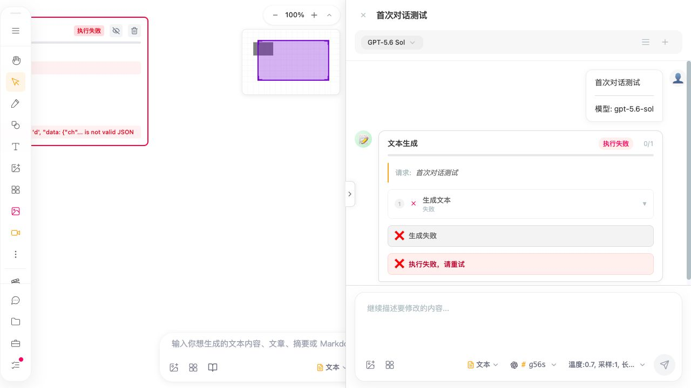
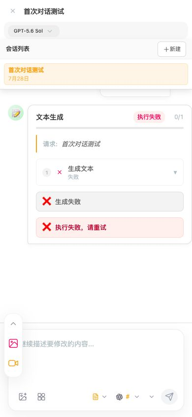
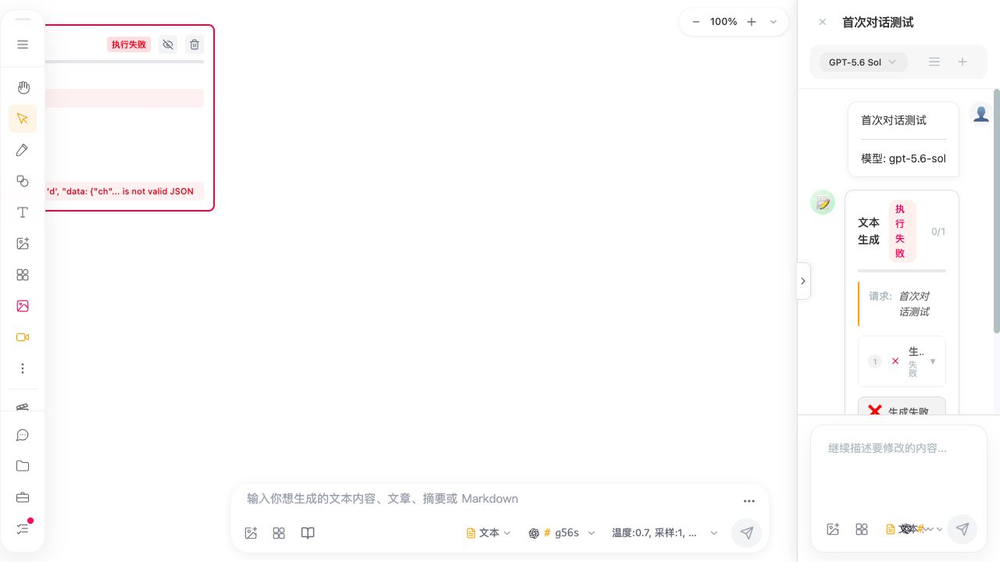

# F-12 Chat Drawer shell, session, and composer interface evidence

Date: 2026-07-30 (Asia/Shanghai)

## Scope and evidence limits

- User scenario: a user opens and closes the existing Chat Drawer, edits its current session title, opens the session list, selects/renames/deletes a session, reads ordinary empty/loading/error states, and operates the existing composer on desktop, tablet, mobile, keyboard, touch, and assistive-technology paths.
- In scope: Drawer disclosure/shell/width/focus/Escape, title editing, session list and item structure, ordinary `ChatMessagesArea` state semantics, `EnhancedChatInput` control names/locale, compact reachability, hit geometry, and responsive width continuity.
- Out of scope: F-11 `WorkflowMessageBubble`; Chat message/session storage counts and terminal durability; busy-send and in-flight session isolation; provider/model/task/workflow execution; attachment data conversion; startup lazy mounting; adding queue/stop/regenerate/parallel Chat capabilities.
- Source state: this workspace has no Git metadata. History, worktree cleanliness, diff provenance, and Git-based rollback cannot be verified.
- Privacy: the browser build displayed the synthetic F-11/F-12 fixture already present in the isolated in-app test profile. The investigation did not inspect browser storage, cookies, IndexedDB/localForage contents, API keys, tokens, `.npmrc`, provider requests, telemetry payloads, or external user data. It did not send a Chat or generation request.
- These are current-source, DOM/accessibility, keyboard, viewport-transition, and computed-geometry facts. They are not performance measurements; no speed, memory, render-count, or bundle-size improvement is claimed.

## Environment and method

- Source: current workspace files and production build in `dist/apps/web`.
- Existing focused tests: workspace Node.js runtime, Vitest 3.2.4, jsdom; 3/3 files and 8/8 assertions passed in 11.60 seconds.
- Browser: production build served locally by Python HTTP server on `127.0.0.1:7200`; Codex in-app Chromium (exact revision unavailable); no network/CPU throttling; CSS zoom 100%; viewport samples 1280 × 720, 390 × 844, and 320 × 568.
- Interaction: visible native controls were located from fresh accessibility snapshots. Pointer click opened/closed UI; a real browser keyboard Escape closed from the focused Drawer textarea. DOM evaluation was read-only and returned bounded role/attribute/geometry projections.
- Browser screenshots are JPEG bytes emitted by the screenshot path but retain `.png` filenames. Each contains only the local synthetic test fixture.

## Related specifications and active changes

- No formal current spec owns the Chat Drawer shell/session/responsive/accessibility behavior. The new approval-gated owner is `improve-chat-drawer-interface-accessibility` (`chat-drawer-interface-accessibility`).
- `fix-chat-message-persistence-consistency` owns message count, terminal durability, tool-patch ordering, legacy reconciliation, and committed session metadata. This interface change does not alter those writes.
- `fix-chat-inflight-session-isolation` owns busy draft retention, latest session-load projection, and origin-session stream ownership. This interface change does not alter send or load acceptance.
- `improve-workflow-status-interface-accessibility` owns workflow bubbles and WorkZone status details, not the Drawer shell/session/composer.
- `improve-ai-input-control-accessibility` owns the canvas AI input bar. It explicitly used the Drawer controls as a positive accessible-name comparison; this F-12 change owns only Drawer localization/geometry.
- `refactor-startup-shell-loading` proposes a lightweight Chat controller and lazy mount. This change preserves current mount/loading semantics; any later controller must carry the approved entry/name/focus contract without duplicating it.
- The application forces a light palette and globally limits animation under reduced-motion. Missing dark mode and component-local animation overrides are not F-12 defects.

## Current forward and reverse chains

### Drawer shell and width

Forward: `drawnix.tsx:177-181,1758-1760` lazy-mounts `ChatDrawer` → `ChatDrawer.tsx:135-158` restores open/width state → `ChatDrawerTrigger.tsx:18-45` emits the native disclosure button → `ChatDrawer.tsx:753-766` toggles/closes → `:1580-1722` renders trigger plus Drawer → `chat-drawer.scss:20-50,234-266` applies hidden/open geometry.

Width: pointer drag `ChatDrawer.tsx:254-285` or window resize `:287-298` writes `drawerWidth` → `:242-245` projects it to `ChatDrawerContext` → inline Drawer width `:1592` and trigger offset `ChatDrawerTrigger.tsx:20-25` → `ViewNavigation.tsx:71-85` uses the same context width. Only pointer mouse-up writes the existing `chat-drawer-width` localStorage key.

Reverse: visible Drawer/trigger rectangle → inline width and open class → React `drawerWidth/isOpen` → cached width/drawer state. A close from the header, trigger, Escape listener, or ref API ends at the same open state; the ref API is used by `useChatDrawerControl`, workflow submission, and AI input paths.

### Title and sessions

Forward title: current `sessions` + `activeSessionId` → title derivation `ChatDrawer.tsx:1521-1528` → click-only heading `:1625-1632` → local edit field `:1614-1623` → Enter/blur `:1537-1563` → `handleRenameSession` `:842-851` → `chatStorageService.updateSession` plus `sessions` state.

Forward sessions: session-list button `ChatDrawer.tsx:1647-1658` → `showSessions` → `SessionList.tsx:46-91` → `SessionItem.tsx:90-136` → select/rename/delete callbacks → `ChatDrawer.tsx:785-851` → Chat storage and in-memory session list. Delete alone crosses `ConfirmDialog`; rename and select do not.

Reverse: visible session title/time/active styling → `SessionItem` props → `sessions` state → storage load at `ChatDrawer.tsx:450-495`; session selection/reload message correctness remains owned by the pending isolation change.

### Ordinary messages and composer

Forward: `useChatHandler` status/messages → `ChatDrawer.tsx:1512-1519` wrapper → lazy `ChatMessagesArea` `:1687-1703` → ordinary message, loading, error, or empty render at `ChatMessagesArea.tsx:89-177`. Workflow-marker messages branch to the separately owned workflow bubble.

Composer: `EnhancedChatInput.tsx:488-627` → text/attachment/generation controls → `handleSend` `:304-382` → `ChatDrawer.handleSubmitDrawerGeneration`/normal wrapper → existing request or workflow path. Application language reaches `EnhancedChatInput` at `:102`, but the preview language is fixed to `zh` at `:419,461` and the send name is a Chinese literal at `:621`; parent placeholder is a Chinese literal at `ChatDrawer.tsx:1718`.

Reverse: visible ordinary message/status → unique message/state render branch → `useChatHandler` owner; visible composer control → current component literal/i18n value → same existing callback. This investigation does not alter callback results, message state, prompt history, storage, or provider requests.

## Controlled observations

### Existing test baseline

Command:

`PATH=<bundled-node-bin>:$PATH pnpm --dir packages/drawnix exec vitest run src/components/chat-drawer/__tests__/EnhancedChatInput.test.tsx src/components/chat-drawer/__tests__/UserMessageBubble.test.tsx src/components/chat-drawer/__tests__/ChatMessagesArea.test.tsx --reporter=verbose`

Result: exit 0; 3/3 files and 8/8 tests passed; 11.60 seconds. The run printed existing `indexedDB is not defined` ConfigWriter stderr, React `act(...)` warnings, stale Browserslist data, and a third-party sourcemap warning. Those messages did not fail the assertions and are classified as test-environment/tool noise, not F-12 product defects.

The existing tests cover composer shell/placeholder/implicit references, one image preview, and one message-area media preview. There is no current Drawer, Trigger, SessionList, or SessionItem test.

### Desktop DOM, focus, and sessions

- Closed 1280 × 720: Drawer width 640 at x=1280 and hidden; trigger 18 × 48 at x=1262.
- Open 1280 × 720: Drawer width 640 at x=640. It had no role, `aria-labelledby`, or `aria-modal`; the trigger had `aria-expanded` but no `aria-controls`.
- Opening by pointer left focus on the native trigger. This is not classified as a defect by itself because the Drawer is non-modal and the trigger precedes it in DOM order.
- From a focused Drawer textarea, a real browser Escape closed the Drawer; after its transition, focus was `body`, not the opener.
- The current title was an `h2` with no role/tab index. Pointer activation focused an edit input whose `aria-label`, `aria-labelledby`, and placeholder were all absent.
- Pressing Escape in the title edit field removed the field and the next accessibility snapshot showed the Drawer closed. Current source has an edit Escape handler without propagation control plus a window Escape close handler.
- The session list had no list/navigation role or name. Its active row was `role=button`, `tabIndex=0`, had no `aria-current`/`aria-selected`, and contained two native button descendants.
- Session edit/delete rectangles were each 22 × 32 CSS pixels; their parent action group computed to opacity 0 without hover.
- The unique session-row key handler at `SessionItem.tsx:97` invokes selection only for Enter. Space has no selection path; native descendant buttons remain keyboard-operable.
- The resize handle was an 8-pixel generic `div` with no role, name, tab index, orientation, or value and only an `onMouseDown` production event.

### Compact reachability and geometry

At 390 × 844:

- The open Drawer was 390 CSS pixels with client/scroll width both 390 (no self horizontal overflow).
- The side trigger and header session actions computed to `display: none`.
- Closing via the named close button and waiting for the 300ms transition produced `visibility: hidden`, active element `body`, trigger `display: none`, and zero visible named controls containing Chat/对话.
- When the session list had already been opened on desktop, its edit/delete controls remained opacity 0 and 22 × 32 on this touch-size viewport.

At 320 × 568:

- The open Drawer and body client/scroll widths were all 320, with no Drawer/body horizontal overflow in the measured state.
- Visible hit boxes were: close 36 × 32.1; upload 34 × 32.1; library 34 × 32.1; send 39.6 × 39.4 CSS pixels.
- Header session-list/new-session actions computed to `display: none`.

Responsive round trip:

- Initial 1280 Drawer: 640 CSS pixels.
- The window resize listener uses `maxWidth = innerWidth - 60` and writes that value without a minimum. At 320 it therefore writes 260 while mobile CSS visually forces `100vw`.
- Returning directly to 1280 does not increase state because the resize effect only changes widths greater than the new maximum. The observed desktop Drawer became 260 CSS pixels at x=1020, below the declared 375 minimum, and workflow/session content wrapped into narrow vertical fragments.
- Reloading the same build restored the cached/default 640-pixel desktop width, proving the failure is current in-memory responsive continuity rather than a persisted schema migration.

## Confirmed issues

### [CHAT-DRAWER-MOBILE-ENTRY-002]

- Status: confirmed current-source and browser behavior; implementation blocked by OpenSpec approval.
- User impact: at 768 CSS pixels or less, a user who closes ordinary Chat has no visible UI control to reopen it. A later workflow may programmatically open Chat, but that is not an ordinary user entry.
- Reproduction/current/expected: at 390 × 844 open the Drawer, activate `关闭对话`, wait for the transition, then enumerate visible named controls. Current result: hidden Drawer, hidden trigger, zero visible Chat/对话 controls. Expected: one named reachable control reopens the same existing Drawer.
- Evidence: `chat-drawer.scss:744-787` hides the only trigger; `:949-957` also hides session header actions below 480; full production search finds no second ordinary Chat opener. Browser raw values are in `metrics.json`.
- Call chain: `Drawnix → ChatDrawerTrigger → handleToggle/isOpen → close → compact CSS display:none → no DOM user event → no ref open call`. Reverse search from every production `open/toggle` writer reaches the same hidden trigger or programmatic workflow/AI callers.
- Root cause: compact CSS says another opening method will be used, but no reachable production UI registered that method.
- Impact range: confirmed at 390; source media query covers widths ≤768. Toolbar docking/safe areas and 320 landscape remain post-approval validation cases.
- Evidence strength: strong production reachability search + source media rule + real close/re-enumeration.
- Candidate/alternative: keep/reposition the existing trigger as a 44-pixel compact control using the same toggle callback. A new navigation destination is rejected; relying on programmatic workflows is rejected because it does not satisfy ordinary user intent.
- Risk: overlap with compact toolbar, safe-area, z-index, or the pending startup controller.
- Validation/rollback: close/reopen at 320/390/768 by pointer/Enter/Space across toolbar states; rollback only the scoped entry markup/style/tests, with no storage changes.

### [CHAT-DRAWER-WIDTH-ROUNDTRIP-003]

- Status: confirmed current-source and browser responsive-state defect; implementation blocked by OpenSpec approval.
- User impact: resizing/orienting from desktop to a narrow viewport and back can leave Chat only 260 pixels wide, below its declared minimum, making controls and status text hard to read and operate until reload.
- Reproduction/current/expected: open at 1280 (640px), set viewport to 320, return to 1280. Current result: 260px at x=1020; reload restores 640px. Expected: compact full screen without overwriting the preferred desktop width, then restore 640px (±1) and never below 375 when space permits.
- Evidence: `ChatDrawer.tsx:115-117,145-154,287-298,1592`; `chat-drawer.scss:744-750`; normal and round-trip screenshots/metrics.
- Call chain: window resize → `maxWidth=innerWidth-60` → `setDrawerWidth(260)` → mobile `100vw !important` masks value → Context/trigger/navigation receive 260 → desktop return keeps 260 → inline style renders narrow Drawer. Reverse visible width points uniquely to the inline state.
- Root cause: compact effective width and preferred desktop width share one state, and the resize shrink path omits the existing minimum and any restoration policy.
- Impact range: viewport/orientation transitions in the same mounted session; no evidence of a corrupt persisted width record because resize alone does not write the cache.
- Evidence strength: strong code arithmetic + controlled before/after/reload geometry + screenshots.
- Candidate/alternative: retain preferred desktop width separately and let compact CSS determine effective width. Merely clamping back to 375 is rejected because it still loses the user's previous width.
- Risk: `ChatDrawerContext` and `ViewNavigation` consume the width; their offset must converge with actual visible desktop geometry.
- Validation/rollback: 10 desktop↔compact round trips, context/navigation offset, drag/cache and resize-no-cache tests; revert width-state/effective-width changes together, no migration.

### [CHAT-DRAWER-TITLE-EDIT-004]

- Status: confirmed source + real DOM/keyboard behavior; implementation blocked by OpenSpec approval.
- User impact: keyboard users cannot start current-title editing; screen-reader users receive an unnamed edit field; pressing Escape to cancel editing also closes Chat and loses focus.
- Reproduction/current/expected: inspect/focus the title (not focusable), pointer-click it (unnamed input receives focus), press Escape (edit disappears and Drawer closes). Expected: named native edit activation by Enter/Space, labelled field, Escape cancels only editing and returns focus while Drawer remains open.
- Evidence: `ChatDrawer.tsx:544-555,1525-1571,1614-1632`; browser attributes and close snapshot.
- Call chain: sessions/active ID → heading click → local edit state/input → Enter/blur → rename storage; edit Escape → cancel state → same native event reaches window Escape → Drawer close. Reverse storage writer remains only `handleRenameSession`.
- Root cause: pointer behavior was attached directly to a heading, the edit input lacks a label, and nested edit/global Escape owners are not ordered.
- Impact range: current-session header title. `SessionItem` rename uses a separate field with the same propagation risk and is covered by the session requirement.
- Evidence strength: strong source event chain + real DOM/focus + observed close.
- Candidate/alternative: native named edit control and labelled input; stop/coordinate Escape at the nested edit owner. Adding `tabIndex`/key listeners to the heading is rejected because it recreates button semantics manually.
- Risk: blur plus Enter can double-save; focus restoration and global close need one owner.
- Validation/rollback: pointer/Enter/Space/Enter-save/Escape-cancel/blur tests with storage call counts; restore current markup/handlers if rolled back, no schema change.

### [CHAT-SESSION-STRUCTURE-005]

- Status: confirmed source + real accessibility-tree defect; implementation blocked by OpenSpec approval.
- User impact: session selection contains nested edit/delete buttons under another button role, Space cannot select the row, active state is only visual, and keyboard/touch users can encounter invisible 22 × 32 actions.
- Reproduction/current/expected: open session list, inspect row roles/attributes/descendants and computed action opacity; press-source review shows only Enter selection. Expected: separate native selection and sibling action controls, explicit active state, Enter/Space parity, focus/non-hover visibility, compact 44-pixel targets.
- Evidence: `SessionItem.tsx:17-70,90-136`; `SessionList.tsx:46-90`; `chat-drawer.scss:555-712`; browser nested tree/geometry.
- Call chain: `sessions` state → `SessionList` → row selection/edit/delete → ChatDrawer select/rename/delete → storage/confirmation → sessions state. Reverse visible row/action uniquely maps to those three callbacks.
- Root cause: the entire visual row was promoted to `role=button` after real action buttons were already nested inside it, while CSS exposes actions only on row hover.
- Impact range: every session row; actual CRUD correctness/persistence is not claimed defective here.
- Evidence strength: strong real DOM/accessibility tree + exact CSS geometry + source key handler.
- Candidate/alternative: list/list-item with a native selection button and sibling edit/delete buttons, `aria-current` or one equivalent active state, `:focus-within` and pointer-coarse visibility. More key listeners on the row are rejected.
- Risk: flex/ellipsis/active styling, delete-dialog focus, and accidental row selection from action clicks.
- Validation/rollback: native role/name/active/nesting, Enter/Space, focus-visible, 50-character zh/en title, confirmation and callback-count tests; rollback markup/styles/tests together.

### [CHAT-DRAWER-FOCUS-REGION-006]

- Status: confirmed source + real DOM/keyboard behavior; implementation blocked by OpenSpec approval.
- User impact: assistive technology cannot discover Chat as a named region or associate the opener with it; closing from inside by Escape leaves focus on `body`, forcing keyboard users to relocate their position.
- Reproduction/current/expected: open at desktop, inspect Drawer/trigger attributes, focus Drawer textarea, send real Escape, wait for transition. Current: no region/name/controls relation; close succeeds; active element becomes body. Expected: named non-modal region, connected disclosure, close returns focus to visible opener. Programmatic workflow open must not steal focus.
- Evidence: `ChatDrawerTrigger.tsx:28-43`; `ChatDrawer.tsx:544-555,1582-1601`; browser attributes and active-element result.
- Call chain: trigger/ref → open state → generic Drawer div; focused descendant → window Escape → close state → hidden focused subtree → browser body fallback. Reverse DOM has no focus-return writer.
- Root cause: visual disclosure/open state exists without an ID/region/focus lifecycle contract.
- Impact range: manual open/close and programmatic opens. A focus trap/modal conversion is not requested.
- Evidence strength: strong real browser keyboard/focus + source absence.
- Candidate/alternative: `aria-controls` plus named complementary region and captured user opener on close; modal dialog/trap rejected because desktop Chat is intentionally non-modal.
- Risk: auto-open focus stealing and nested deletion dialog ownership.
- Validation/rollback: opener variants, Escape/close, auto-open, nested edit/dialog tests; remove semantics/focus restoration to roll back, no data effects.

### [CHAT-DRAWER-STATUS-007]

- Status: confirmed reachable render-contract defect; implementation blocked by OpenSpec approval.
- User impact: a screen-reader user receives no bounded notification when an ordinary Chat request starts thinking or reaches the existing error UI.
- Reproduction/current/expected: drive `ChatHandler.status` to submitted/streaming and render an ordinary error message; current unique branches emit visual `div`/text and error CSS only, with no role/live/alert attribute. Expected one concise localized lifecycle status and one safe terminal error announcement without making the transcript live.
- Evidence: `ChatMessagesArea.tsx:89-177`; lazy fallback `ChatDrawer.tsx:1688-1694`; no role/live writer in either branch.
- Call chain: normal provider/useChatHandler state → ChatDrawer wrapper → ChatMessagesArea `showLoading`/error-prefix branch → visible spinner/error bubble. Reverse visible loading/error has one component writer.
- Root cause: lifecycle is encoded only in visual spinner/copy/class names.
- Impact range: ordinary Chat submitted/streaming/error UI; F-11 workflow progress/status is excluded.
- Evidence strength: strong unique render branch + type/status owner; provider execution was not required.
- Candidate/alternative: generic bounded localized status/alert that excludes prompt/response/error payload. Making the full message list live is rejected due repeated streaming and privacy noise.
- Risk: duplicate announcements on rerender or provider payload leakage.
- Validation/rollback: transition/unchanged rerender tests with sentinel secrets absent from names/live text; remove semantic nodes/attributes to roll back.

### [CHAT-DRAWER-I18N-008]

- Status: confirmed source localization-boundary defect; implementation blocked by OpenSpec approval.
- User impact: English-language users receive mixed Chinese Drawer/session/empty/loading/composer labels even though equivalent English Chat translations already exist.
- Reproduction/current/expected: follow the outer `I18nProvider` into Drawer components. `ChatDrawer`, Trigger, SessionList, SessionItem, and ChatMessagesArea do not consume it and render Chinese literals; EnhancedChatInput consumes language only partially but fixes preview language to zh and send to Chinese. Expected application-owned copy follows zh/en; user/provider/stored data stays unchanged.
- Evidence: existing keys `i18n.tsx:132-149,324-340,513-530`; literals in `ChatDrawerTrigger.tsx:28-39`, `ChatDrawer.tsx:1523,1604-1666,1718`, `SessionList.tsx:46-90`, `SessionItem.tsx:72-130`, `ChatMessagesArea.tsx:121-176`, `EnhancedChatInput.tsx:102,419,461,621,638`.
- Call chain: global language owner → components that bypass `useI18n` → fixed literals/`zh-CN` time → visible/accessible copy. Reverse copy search points to those literals rather than stored data.
- Root cause: an existing Chat translation table was not wired into the Drawer implementation; one child hard-codes its preview locale after reading current language.
- Impact range: application-owned shell/session/ordinary-state/composer strings only. Stored session titles/messages, model names, workflow data, attachment names, and provider text are non-targets.
- Evidence strength: strong current translation definitions + unique render source; the exact full English browser inventory remains an approval-time regression test.
- Candidate/alternative: reuse existing keys, add focused missing keys, use active locale for previews/time. Translating stored/generated data is rejected.
- Risk: incomplete inventory or accidentally translating data strings.
- Validation/rollback: zh/en initial/switch tests and sentinel byte preservation; restore literals/locale props to roll back, no data migration.

### [CHAT-DRAWER-TOUCH-009]

- Status: confirmed measured interaction-geometry defect; implementation blocked by OpenSpec approval.
- User impact: existing compact Chat controls require precise touch targeting; session edit/delete are both invisible without hover and below the project convention.
- Reproduction/current/expected: measure named native controls at 320/390 and the desktop side trigger at 1280. Current measured boxes range from 18 to 39.6 pixels on one dimension. Expected at least 44 × 44 at compact/pointer-coarse boundaries without enlarged glyphs, changed callbacks, or overflow.
- Evidence: exact browser rectangles in `metrics.json`; `chat-drawer.scss:195-219,234-266,615-711,744-985`; AI input control sizing inherited by EnhancedChatInput.
- Call chain: viewport/pointer capability → scoped CSS → button rectangle → hit testing → unchanged close/reopen/session/upload/library/send callback.
- Root cause: desktop-sized 18/32-pixel controls are reused or only raised to 34–39 pixels on compact layouts; session controls rely on hover.
- Impact range: measured at 320/390 and desktop trigger geometry; physical devices, 200% zoom, landscape, and safe areas remain validation gates.
- Evidence strength: strong computed geometry + named-control source + screenshot.
- Candidate/alternative: enlarge hit boxes only under compact/pointer-coarse rules and expose focus/non-hover actions. Enlarging glyphs or hiding controls is rejected.
- Risk: composer/header crowding and overlap at 320.
- Validation/rollback: 44-pixel minimum, zero horizontal overflow/overlap, visible focus, one callback per input; remove scoped geometry/focus styles to roll back.

### [CHAT-DRAWER-RESIZE-010]

- Status: confirmed source + real DOM accessibility defect; implementation blocked by OpenSpec approval.
- User impact: a keyboard user cannot operate the existing desktop width-resize feature or discover its current/min/max value.
- Reproduction/current/expected: inspect/focus-search the 8-pixel resize handle. Current: generic div, no tab index/role/name/orientation/value, mouse-down only. Expected one named vertical separator/equivalent that changes the same bounded width with Arrow keys; compact mode keeps it hidden because resize is inapplicable.
- Evidence: `ChatDrawer.tsx:157-158,254-304,1595-1600`; `chat-drawer.scss:57-87,756-758`; browser attributes.
- Call chain: handle mouse-down → document mousemove → width state/context → Drawer/trigger/navigation → mouse-up cache write. No keyboard entry reaches this chain.
- Root cause: resize was implemented solely as an unsemantic pointer hit strip.
- Impact range: desktop width adjustment only; compact resize is intentionally not existing behavior.
- Evidence strength: strong unique event/DOM path + real attributes.
- Candidate/alternative: semantic separator with Arrow keys using the same clamp function. Separate hidden resize buttons are rejected as a second owner/new UI.
- Risk: drag/keyboard divergence and cache-write timing.
- Validation/rollback: Arrow/pointer boundaries, aria values, Context/trigger/navigation geometry, cache call counts; restore current div/handlers if rolled back.

## Non-findings and blockers

- The side trigger, close, session-list, new-session, upload, library, and send controls are native buttons. The findings concern reachability, relationships, names/localization, focus, visibility, and geometry—not missing native click semantics across all of them.
- Opening a non-modal Drawer and leaving focus on its disclosure trigger is not classified as a defect by itself. The confirmed focus failure is closing from inside to `body` and the missing named/control relationship.
- Drawer/body horizontal overflow was zero in the measured 320/390 states. No general compact overflow defect is claimed.
- The app intentionally forces light mode and globally handles reduced motion; neither is changed here.
- The responsive width defect was reproduced once with exact state arithmetic and before/after/reload controls. It is a correctness result, not a latency/performance sample.
- OpenSpec CLI is unavailable; strict validation cannot be reported as passed. Manual checks and the exact exit code are recorded separately.

## Screenshots

## Current decision

`improve-chat-drawer-interface-accessibility` is approval-gated. No production component, CSS, i18n behavior, storage, request, or startup behavior has been changed in this sub-loop. F-12 remains investigation-complete for this UI boundary but does not meet its full exit standard until this change and the two independent persistence/in-flight changes are approved, implemented, and reverified.

