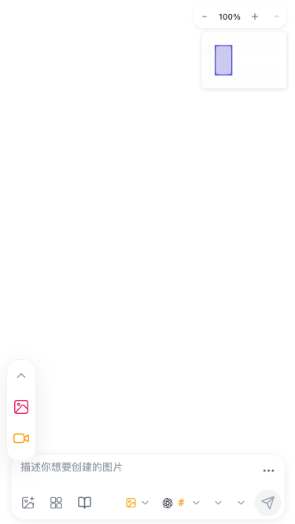

# F-28 responsive, accessibility, and visual-consistency evidence

Date: 2026-07-30 (Asia/Shanghai)

## Scope and environment

- Source state: current workspace without Git metadata; worktree cleanliness, diff provenance, and history cannot be checked.
- Runtime: workspace-provided Node.js 24.14.0 and Playwright Chromium revision 1228 on Darwin 22.6.0 x86_64.
- Browser observations used the local application, one Playwright worker, default network/CPU conditions, light theme, Chinese UI, and no external provider request.
- The temporary compatibility symlink from Chromium revision 1200 to 1228 was removed after the run. The local Vite session was stopped with Ctrl-C.
- These are geometry and test-gate observations, not performance measurements. No speed, memory, render, or bundle-size improvement is claimed.
- OpenSpec CLI is absent from `PATH`; strict validation is recorded as blocked and is not represented as passing.

## Feature boundary and user scenario

The audited path is the existing responsive canvas shell: a user opens the canvas on desktop, tablet, or mobile; the unified toolbar and primary canvas AI input are laid out; the user expands/collapses the mobile toolbar and operates its actions or the input controls by touch. The current responsive Playwright suite is the regression gate for those states.

In scope: the primary `AIInputBar`, unified toolbar responsive styles, safe-area offsets, collapsed toolbar state, stacking, responsive screenshots, overlap geometry assertion, and touch-target sampling. Cross-feature keyboard/name defects already owned by other active changes remain out of scope. Chat Drawer layout, AI submission/model behavior, toolbar action behavior, global z-index redesign, new mobile navigation, and generic visual retheming are not part of this loop.

## Current forward and reverse chain

Forward:

`responsive-visual.spec.ts:61-177,184-235,264-282` sets one of seven viewports → `page.goto('/')` → `waitForPageReady()` waits for `.drawnix` and `.unified-toolbar` → the application mounts `AIInputBar.tsx:4802-4809` with `data-testid="ai-input-bar"` → `index.scss:181-201,336-377` fixes and responsively places the unified toolbar → `ai-input-bar.scss:50-64,1611-1650,1777-1787` fixes and responsively places the primary input → Playwright captures screenshots, reads `boundingBox()` for both surfaces, computes their intersection, and samples visible buttons.

Reverse:

- The visible primary input root has one stable `data-testid="ai-input-bar"` writer at `AIInputBar.tsx:4809`.
- The Chat Drawer composer imports the same stylesheet and deliberately reuses the visual `.ai-input-bar` class at `EnhancedChatInput.tsx:43,490`, but it does not own the primary-input test id.
- The overlap assertion has one writer at `responsive-visual.spec.ts:220-235`; it reads the unique primary input plus the unified toolbar.
- The mobile toolbar bottom position is written by the tablet/mobile rules at `index.scss:336-377`; the primary input bottom/width is written by `ai-input-bar.scss:1611-1650,1777-1787`.
- Stacking is deterministic: the toolbar compiles from `$z-side-drawer + 1` (`index.scss:185`, `z-index.scss:52`) to 4031, while the primary input uses `$z-canvas-internal` (`ai-input-bar.scss:55`, `z-index.scss:11`) at 100.

State ownership and side effects:

- Viewport and responsive media-query state are browser-owned. The toolbar component owns expanded/collapsed state; the Playwright test begins from its existing collapsed mobile state and does not persist a new layout.
- Both surfaces are fixed-position DOM elements; their layout has no network, IndexedDB, Cache API, localStorage, sessionStorage, Service Worker, analytics, or migration side effect in this observed path.
- There is no timeout/cancel/retry/data-recovery branch for CSS layout. Page load failure is owned by the startup test boundary; the responsive test only proceeds after the existing readiness selectors.
- Safe-area expressions are present in both rules. The observed desktop browser reported zero safe-area insets; iOS notch/home-indicator behavior remains a post-approval browser/device verification item.

## Controlled results

### Responsive locator drift and repair

Before the test-only edit, `.ai-input-bar` resolved to the primary canvas input and the Chat Drawer composer that reuses the same visual class. Eight of eleven tests failed in Playwright strict mode before reaching their intended assertions; three passed.

The test now uses the existing unique `data-testid="ai-input-bar"` at `responsive-visual.spec.ts:70,88,107,122,141,156,171,217`, and touch sampling uses `.unified-toolbar button, [data-testid="ai-input-bar"] button` at `:270-272`. No production file, DOM contract, screenshot baseline, assertion threshold, timeout, or product behavior changed.

After the edit, the same single-worker responsive suite reached ten of eleven passing tests. All seven layout screenshots, toolbar expand/collapse, view navigation, and sampled touch-size checks passed. The sole remaining failure reached the existing geometry assertion and reported 304 CSS px² of intersection against `<100`.

Focused E2E TypeScript compilation exited 0. Focused ESLint for the edited test exited 0 with eight existing warnings and no error. Exact fresh post-documentation commands are recorded in the feature ledger.

A fresh exact full-file run using the same configured responsive project exited 1 with 9/11 passing. The 304 CSS px² geometry failure reproduced. A second failure occurred only in the 640×360 screenshot: 25,891 pixels, ratio 0.12, differed from the current snapshot against the test's 0.10 limit. The received image had different inspiration-card content/assets. With no source or server change, an immediate two-repeat run of that exact test passed 2/2. This proves a non-deterministic visual-test observation, but it does not prove its cause. No snapshot was updated.

Repository-width comparison gates after the test-only edit: full typecheck 5/5 projects and runtime cycle check passed; production build passed with 7,931 modules, app build 1m31s and SW build 1.48s; startup validation passed with no chunk cycle. Real tests run with Nx cache disabled retained the preceding four failure clusters: Drawnix 184 pass/4 fail/1 skip files and 1161 pass/3 fail/1 skip tests; react-board 1/1 file and 8/8 tests passed. Size retained AI Chat as the sole failure at 844.43/140 kB gzip. Full lint retained its known invalid package-`node_modules` scan and exited 1; edited-file lint is the scoped signal. Build-generated `version.json`, `index.html`, and `sw.js` were restored to their pre-build hashes. None of these existing failures is attributed to F-28.

### Cross-viewport geometry

One direct Playwright geometry sample was taken at each existing suite viewport under the same browser session and application state:

| Viewport | Intersection width × height | Area | Top surface |
| --- | --- | ---: | --- |
| 1920×1080 | 0×0 | 0 CSS px² | none |
| 1280×720 | 0×0 | 0 CSS px² | none |
| 1024×768 | 0×0 | 0 CSS px² | none |
| 768×1024 | 0×0 | 0 CSS px² | none |
| 640×360 | 38×12 | 456 CSS px² | unified toolbar |
| 375×667 | 38×8 | 304 CSS px² | unified toolbar |
| 360×640 | 38×8 | 304 CSS px² | unified toolbar |

At 375×667:

- toolbar: `x=8, y=457, width=38, height=130, bottom=587`, computed `bottom: 80px`, `z-index: 4031`;
- primary input: `x=8, y=579, width=359, height=82, bottom=661`, computed `bottom: 6px`, `z-index: 100`;
- intersection: `x=8..46`, `y=579..587`, 38×8 = 304 CSS px².

The screenshot SHA-256 is `01cee62c4e4e792215baa460eeb2e29d722aaa987910e82d4bb8883ed4ec2f2a`:

### Supplemental attachment-preview state

A later F-07 in-app Chromium sample used the current production artifact at 390×844, light/zh-CN, with two synthetic 1×1 pasted images and no generation/provider request. The primary input expanded to `x=8,y=416.4375,width=374,height=421.5625,bottom=838`; its first preview was `x=26,y=652,width=36,height=36`. The same screenshot visibly shows the higher collapsed toolbar covering the preview's left side and removal-control region:

This is one layout sample, not a performance sample. The run did not separately record the toolbar rectangle, so no exact new intersection area is asserted. It confirms the existing change's already-specified `attachment-preview` state and same fixed-surface root cause; it does not create a second owner or expand the change into attachment data/submission semantics. Raw values, screenshot hash, paste/remove counts, and browser limitations are in `../f07-ai-input/metrics.json` and `../f07-ai-input/diagnostics.md`.

## Confirmed issues

### F28-TEST-001

- Status: confirmed tool/test defect; fixed without product behavior change.
- User scenario: maintainers run the responsive visual gate for a user opening and operating the canvas across desktop, tablet, and mobile viewports.
- Reproduction: run `responsive-visual.spec.ts` against the current application before the locator edit; strict `.ai-input-bar` lookups resolve both primary input and Chat Drawer composer, causing 8/11 failures before layout assertions.
- Current behavior before fix: the test used a shared visual class as if it uniquely identified the primary canvas input.
- Expected behavior: the test targets the existing primary-input identity and reaches its screenshot/geometry/touch assertions.
- Evidence: `AIInputBar.tsx:4802-4809` owns the unique id; `EnhancedChatInput.tsx:43,490` reuses only the visual class; same-suite outcome changed from 3/11 to 10/11 without a production edit.
- Complete chain: Playwright test locator → DOM selector resolution → strict-mode precondition → intended screenshot/geometry/touch assertion → responsive regression result.
- Root cause: the test encoded visual style reuse as component identity after the chat composer adopted the shared class.
- Impact: responsive E2E signal only; no user-facing runtime path was changed.
- Evidence strength: strong, deterministic current-source and before/after suite result.
- Fix: use the pre-existing `data-testid="ai-input-bar"`. Alternative: add a new production class/id; rejected because it would change production markup when a stable identity already exists.
- Verification: focused TypeScript/lint and the same responsive project with one worker; preserve screenshots and `<100` overlap threshold.
- Risk: low; a future removal of the test id will fail directly instead of silently selecting a second composer.
- Rollback: restore the prior selectors in `responsive-visual.spec.ts`; no production or stored data rollback.

### F28-LAYOUT-002

- Status: confirmed visual/interaction defect; runtime fix blocked by OpenSpec approval.
- User scenario: a user opens the canvas at a mobile width, sees the toolbar collapsed at lower left, and operates the primary AI input or the toolbar's visible media actions.
- Reproduction: use 375×667 (also reproduced at 360×640 and 640×360), load `/`, wait for `.drawnix` and `.unified-toolbar`, then compare the two surface rectangles. At 375×667 the intersection is 304 CSS px² and the toolbar is on top.
- Current behavior: the toolbar covers the input's upper-left border/content region; the existing responsive assertion expects less than 100 CSS px² but receives 304.
- Expected behavior: the existing collapsed toolbar and primary input remain visible and operable without one surface covering the other's interactive/content region, including safe-area offsets.
- Evidence: current screenshot, computed rectangles/z-index values, 10/11 focused suite result, and source rules cited above. Desktop/tablet samples are negative controls with zero overlap.
- Complete chain: viewport/media query → fixed toolbar/input CSS → DOM geometry → z-index stacking → visible occlusion → touch/pointer target at the intersection → Playwright regression assertion.
- Root cause: mobile toolbar placement reserves a fixed 80px from the viewport bottom, while the primary input starts at `y=579` with an observed 82px compact height and expands full width from `x=8`; the toolbar ends at `y=587`. The higher toolbar stacking level makes the 8px vertical intersection occlude the input.
- Impact: confirmed at all three current mobile suite viewports and additionally in one 390×844 attachment-preview state; not reproduced at the four desktop/tablet compact-state viewports. Focused/long-text input, dynamic safe-area, landscape browser chrome, dark theme, and physical touch-device behavior remain unmeasured.
- Evidence strength: strong deterministic browser geometry, screenshot, assertion, and static writer trace.
- Preferred change: `fix-mobile-toolbar-input-overlap`; derive the mobile toolbar's lower clearance from the existing primary-input responsive geometry/shared spacing contract and keep both surfaces inside the viewport and safe area.
- Alternative A: shift the primary input horizontally. Rejected because the full-width mobile input is an existing layout invariant and the toolbar is the smaller conflicting surface.
- Alternative B: lower toolbar z-index. Rejected because it would hide toolbar actions behind the input without removing the geometric conflict.
- Alternative C: relax `<100` or update snapshots. Rejected because that would encode the confirmed occlusion as passing.
- Risk: reduced toolbar vertical space can change scrollable action availability on short landscapes; any fix must preserve collapse/expand, scrolling, 44px-oriented touch behavior, safe-area offsets, and desktop/tablet geometry.
- Verification: first add failing geometry tests at 640×360, 375×667, and 360×640; then browser-check collapsed/expanded, focused/expanded/long-text input, safe-area emulation, orientation changes, pointer/touch hit testing, light/dark, Chinese/English, screenshot parity at all seven viewports, and repository gates.
- Rollback: restore the scoped responsive CSS and its focused tests/screenshots. No API, storage, cache, migration, task, or user-data change.

### F28-VISUAL-003

- Status: pending-verification test-stability hypothesis; no code change.
- User scenario: maintainers use the 640×360 responsive screenshot as a regression signal for the canvas shell.
- Reproduction: in one fresh full-file run, the screenshot differed by 25,891 pixels / ratio 0.12 against the per-test 0.10 limit; the received inspiration cards differed from the checked snapshot. Immediately repeat only that test twice without changing source/server/browser state; both repetitions pass.
- Current behavior: one observed run failed and the next two passed, so the gate is not deterministic under the recorded setup.
- Expected behavior: the same source, fixture, viewport, and browser state produces a stable screenshot result.
- Evidence: saved Playwright output/actual/diff in the temporary verification directory during diagnosis and the 0/1 then 2/2 result. The temporary directory is not product evidence and may be removed; the raw counts are retained in `metrics.json` and the ledger.
- Complete chain: page load/readiness → inspiration-board card content/assets → full-page screenshot → pixel comparison → responsive gate result. The precise varying writer/cache/network boundary is not yet proven.
- Root cause: unknown. The observed card/content difference and passing immediate repeats justify investigation, but do not distinguish source fixture selection, asset load timing, Service Worker/cache state, or another cause.
- Candidate verification: intercept/log the card data and image response/cache source for at least five identical isolated runs; freeze only test fixtures after demonstrating which boundary varies. Do not hide the board or raise the threshold unless the screenshot's intended coverage is re-specified.
- Risk: changing screenshots or hiding content before identifying the writer can remove legitimate coverage.
- Rollback: none; no code or snapshot change was made.

## Unknowns and non-findings

- One geometry sample per viewport proves deterministic current layout under the stated state; it is not a performance sample and has no median/range.
- No physical iOS/Android safe-area or high-DPI touch run has been completed. Those states remain unknown until post-approval verification.
- No dark-theme difference was investigated because the collision is fixed-position geometry; dark/light screenshot parity remains required after any visual change.
- The current `<100` assertion permits some border/shadow intersection. This audit does not change that product/test contract without approval.
- In the earlier post-locator run, all seven responsive screenshots passed under their configured 10% maximum diff ratio. That is not evidence that a localized geometric assertion should be removed.
- The 640×360 screenshot passed in the prior 10/11 run and in an immediate 2/2 repeat but failed once in the fresh full-file run. Its variability remains a test-stability hypothesis, not a product visual conclusion.
